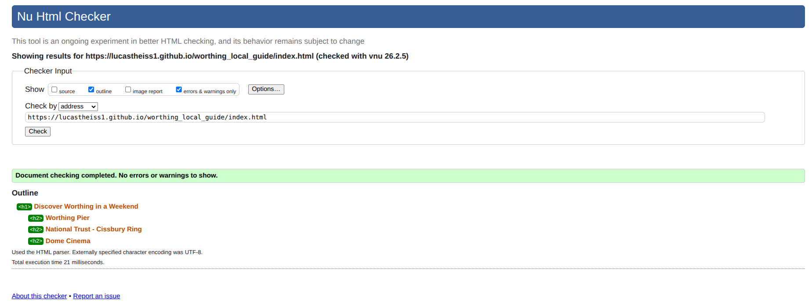
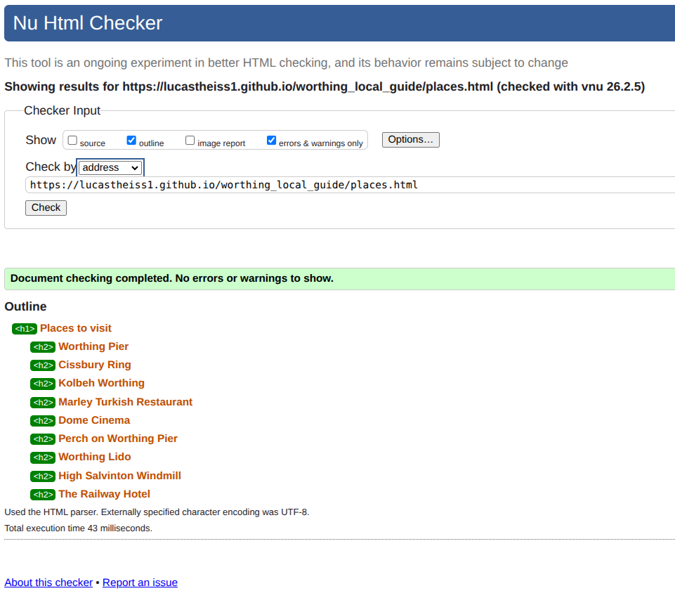
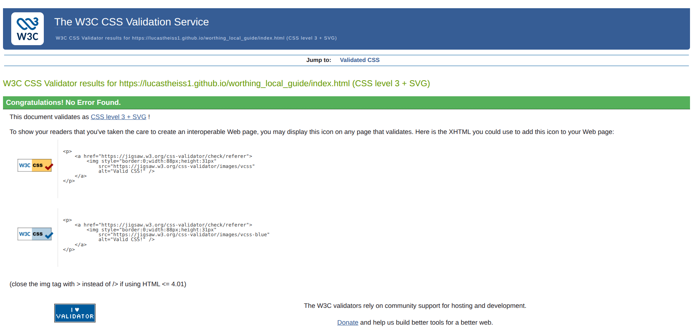
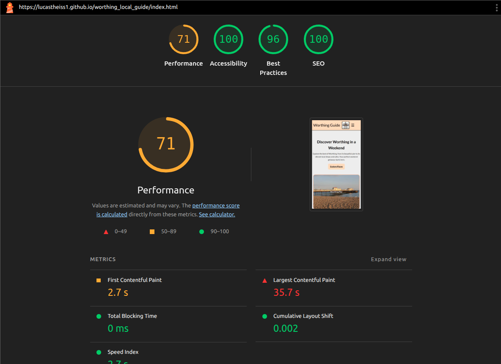
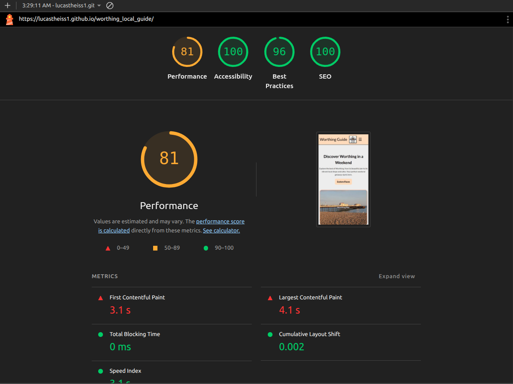

# Worthing Local Guide

---

## Project Overview

Worthing Local Guide is a static front-end website built with HTML and CSS to help visitors and new residents quickly discover places of interest in Worthing, UK.

The site focuses on clarity, accessibility, and responsive design, providing a simple user journey across multiple pages.

---

## User Value

This website helps users to:
- Discover popular places to visit in Worthing
- Get inspiration for a short weekend itinerary
- Access location information through embedded maps
- Navigate easily between pages on different devices

---

## User Experience (UX)

### Target Audience
- Tourists visiting Worthing
- New residents exploring the local area
- Users looking for quick, clear information about local attractions

### UX Design Decisions
- Mobile-first layout to ensure usability on small screens
- Consistent navigation across all pages
- Card-based layout for clear content grouping
- Simple colour palette inspired by coastal and seaside themes
- Desktop-only hover effects to avoid issues on touch devices

---

## Features

- Three-page website: Home, Places, Contact
- Responsive navigation bar with mobile menu toggle
- Featured places section on the home page
- Places page with interactive Google Maps previews
- Contact form with accessible labels (front-end only)
- Footer with social media links
- Responsive layout for mobile, tablet, and desktop

---

## Technologies Used

- HTML5 (semantic markup)
- CSS3 (Flexbox, Grid, Media Queries)
- Google Fonts
- Font Awesome
- Visual Studio Code
- Copilot Extension (VScode)
- Balsamiq (wireframing)
- Git & GitHub for version control
- GitHub Pages for deployment

---

## Testing

The website was tested manually to ensure functionality and usability:

- Navigation links tested across all pages
- Responsive layout tested using browser developer tools
- HTML validated using the W3C Markup Validation Service
- CSS validated using the W3C Jigsaw Validator
- Images checked for correct scaling and responsiveness
- Text contrast and font sizes reviewed for readability

Screenshots of validation results are included below.

---

## Deployment

The project was deployed using GitHub Pages.

### Deployment Steps
1. Push the project to a GitHub repository
2. Navigate to **Settings → Pages**
3. Select **Deploy from a branch**
4. Choose **main** branch and **root** directory
5. Save and access the generated live link

**Live Site:** 

_[Worthing local guide](https://lucastheiss1.github.io/worthing_local_guide/index.html)_

---

## Credits & Attribution

### Code
Some layout, navigation, and responsive design patterns were inspired by common front-end tutorials, documentation, and examples found in learning resources such as:
- MDN Web Docs
- W3Schools
- General HTML and CSS tutorials

All code was adapted and customised to fit this project’s structure and design requirements.

### Media
- Images sourced via Google Images for educational purposes
- Worthing Coat of Arms image sourced from:  
  https://en.wikipedia.org/wiki/Worthing

### Tools & Libraries
- Fonts provided by Google Fonts
- Icons provided by Font Awesome
- Maps embedded using Google Maps iframe

---

## Validation Evidence

### HTML Validation

_

### CSS Validation

### Lighthouse report
#### Before resizing images and convert to .webp

#### After resizing it

---

## Known Issues & Improvements

### Issues Identified
- Grid layout issues on tablet and desktop breakpoints

### Cause
- Media queries targeting incorrect selectors
- Container width restricting grid expansion

### Resolution
- Corrected media query selectors
- Refactored container width to allow responsive scaling

## Aditional Development Challenges & Solutions

Throughout the development process, several challenges were encountered and resolved:

- Responsive layout issues across mobile, tablet, and desktop devices required careful adjustment of grid structures and container widths.
- Hover-based interactions initially caused usability issues on touch devices, leading to a redesign that ensured content visibility without relying on hover.
- Image sizing inconsistencies caused visual gaps in card layouts, which were resolved by refining image and container responsibilities using object-fit and aspect-ratio.
- Navigation alignment challenges between mobile and desktop views were addressed by refining Flexbox layout rules.
- Interactive maps were implemented using Google Maps iframes to avoid unnecessary JavaScript complexity.
- Some layout patterns were inspired by common tutorials and documentation, requiring careful attribution and adaptation.

These challenges contributed significantly to the learning outcomes of the project and improved overall understanding of responsive and user-centric front-end development.

### Future Improvements
- Enhance the contact form with back-end functionality
- Add additional accessibility improvements

---
